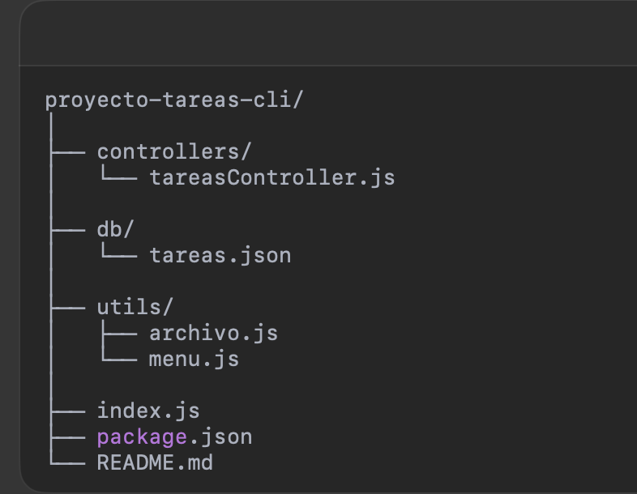

# 🔧 Sistema CLI de Tareas — ¡Don Brian quiere resultados!

> “¡Esto tiene que cambiar! Quiero que ese sistemita que estás usando en consola sirva de verdad.”
>
> — Don Brian, jefe temido pero carismático ☕💼

---

## 🎯 Descripción del proyecto

Este sistema fue refactorizado y potenciado por orden directa de Don Brian. Originalmente funcionaba en memoria y se perdía todo al cerrar la terminal. Ahora:

- Se organiza por módulos profesionales 🧩
- Guarda datos en archivos JSON con persistencia 💾
- Está potenciado por Lodash para orden, unicidad y agrupación 🔍
- Usa una interfaz CLI elegante e interactiva gracias a Inquirer 🎛️
- Tiene colores y validaciones para una mejor experiencia de usuario 🎨

---

## 🚀 Funcionalidades

- ✅ Agregar nuevas tareas
- 📋 Listar tareas (ordenadas por estado y nombre)
- ✏️ Editar descripciones
- 🗑️ Eliminar tareas con confirmación
- ✔️ Marcar tareas como completadas
- 💾 Guardar todo en un archivo `.json`
- 🔁 Sin duplicados (por descripción) gracias a `lodash`
- ⚠️ Validaciones para evitar tareas vacías
- 🎨 Consola amigable con `chalk`

---

## 📁 Estructura del proyecto

---

## 🛠 Tecnologías usadas
	•	Node.js
	•	Inquirer
	•	Lodash
	•	Chalk

---

## USO
1. Instala las dependencias:

        " npm install "

2. Ejecuta el programa:

        " node index.js "

---
## 👨‍💻 Autor

Este proyecto fue desarrollado como parte del taller “Don Brian quiere resultados” en Campuslands.

Desarrollado por: Daniel Arauz 💾
